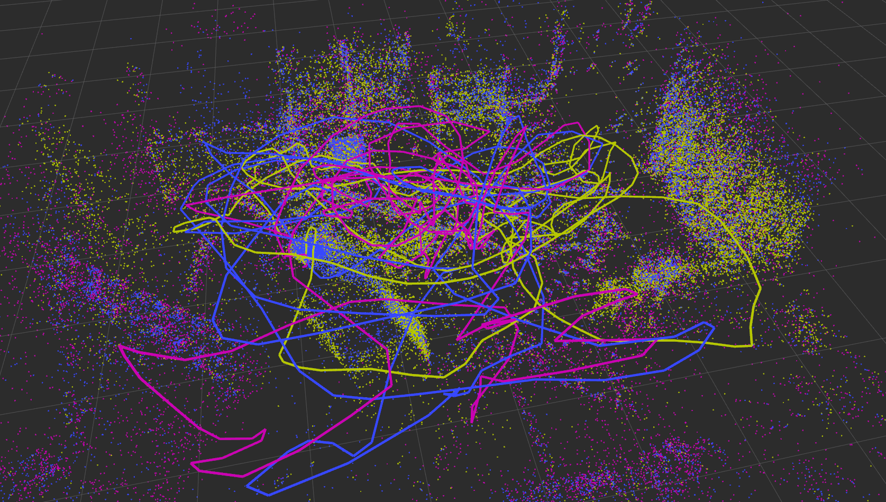

# OpenVINS Maplab Interface

Here we have our interface wrapper for exporting visual-inertial runs from [OpenVINS](https://github.com/rpng/open_vins) into the ViMap structure taken by [maplab](https://github.com/ethz-asl/maplab).
The state estimates and raw images are appended to the ViMap as OpenVINS runs through a dataset.
After completion of the dataset, we re-extract features and triangulate them due to the incompatibilities of the two frontends.
Maplab requires BRISK or FREAK descriptors, while OpenVINS works with KLT or ORB feature tracking.
In the future we will try to only extract descriptors on tracked features from OpenVINS, but for now we just re-detect for simplicity.
We have tested this on the [EurocMav](https://docs.openvins.com/gs-datasets.html#gs-data-euroc) and [TUM-VI](https://docs.openvins.com/gs-datasets.html#gs-data-tumvi) datasets and have had good success with merging the different runs and optimizing the resulting graph.


## Dependencies

* OpenVINS - https://docs.openvins.com/gs-installing.html
* maplab - https://github.com/ethz-asl/maplab/wiki/Installation-Ubuntu


## Installation Commands

```
# setup our workspace
mkdir -p catkin_ws_maplab/src/
cd catkin_ws_maplap
catkin init
catkin config --merge-devel # Necessary for catkin_tools >= 0.4.
catkin config --extend /opt/ros/kinetic/
catkin config --cmake-args -DCMAKE_BUILD_TYPE=Release
# repositories to clone
cd src
git clone https://github.com/rpng/ov_maplab.git
git clone https://github.com/rpng/open_vins.git
git clone https://github.com/ethz-asl/maplab.git --recursive
git clone https://github.com/ethz-asl/maplab_dependencies --recursive
# need to fix the opencv to build with a 3.4.x version
cd maplab_dependencies/3rdparty/opencv3_catkin/
git checkout feature/3.4.2
# go back to root and build
cd ..
catkin build maplab ov_maplab -j4
```


## Processing Map Example

```
# load into the main console
rosrun maplab_console maplab_console
# load all our maps and join them (they should each be a mission)
load_all --maps_folder <your_dataset_folder_path>
join_all_maps --target_map_key mergedmap
# Display all the loaded missions
map_stats
# retriangulate landmarks and remove bad ones
retriangulate_landmarks
remove_bad_landmarks
# Visualize all missions with different colors
spatially_distribute_missions
v --vis_color_by_mission
# anchor the first to be the anchor, then anchor the rest
set_mission_baseframe_to_known
anchor_all_missions
# display the baseframe transforms
print_baseframes
# Pose graph relaxation
relax
# Key-frame the map (needed to reduce memory requirements)
keyframe_heuristic
# Loop close the map.
loopclosure_all_missions
# Visualize all missions with different colors
v --vis_color_by_mission
# Bundle adjustment.
optimize_visual_inertial --ba_num_iterations=50
# Save the final map (overwrite the old map if there is one)
save --overwrite --map_folder <your_new_merged_map_folder_path>
```


## Leveraging Maplab as Groundtruth

A use case is if one wishes to use maplab optimized and loop-closed trajectory as groundtruth for evaluation on datasets which do not have an external pose system (i.e. no vicon available).
For example of the V1\_01\_easy eurocmav dataset before optimization the RMSE was 0.680 degrees and 0.055 meters.
After performing loop closure and optimizing the RMSE was 0.576 degrees and 0.021 meters as compared to the published groundtruth.
Here are a few example commands which we use to process a run on the eurocmav dataset and then optimize it to be used as a groundtruth.
```
# run openvins and export the map
roslaunch ov_maplab pgeneva_eth.launch
# load the map into maplab
rosrun maplab_console maplab_console
load --map_folder ~/datasets/eth/maplab/V1_01_easy/
# optimize the map
retriangulate_landmarks
remove_bad_landmarks
set_mission_baseframe_to_known
loopclosure_all_missions
optimize_visual_inertial --ba_num_iterations=10
# finally, we can export using our custom utility
# this will get it into our space seperated format needed for ov_eval
export_to_openvins --export_path ~/datasets/eth/maplab/
```


## Example Merges

Example map merging of the V1_01_easy, V1_02_medium, and V1_03_difficult from the EurocMav datasets:


Example map merging of the room1, room2, room3, and corridor1 from the TUM-VI datasets:


