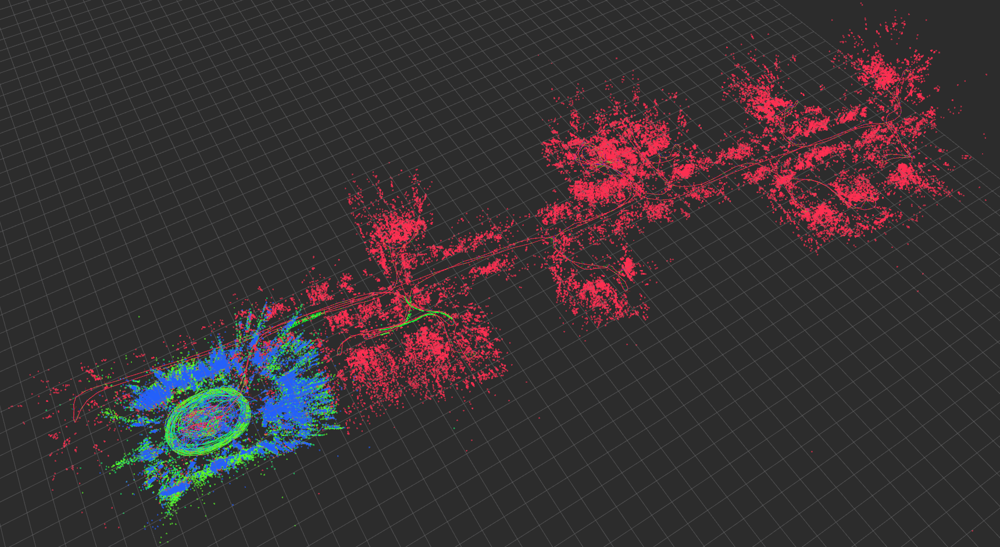

# OpenVINS Maplab Interface

Here we have our interface wrapper for exporting visual-inertial runs from [OpenVINS](https://github.com/rpng/open_vins) into the ViMap structure taken by [maplab](https://github.com/ethz-asl/maplab).
The state estimates and raw images are appended to the ViMap as OpenVINS runs through a dataset.
After completion of the dataset, we re-extract features and triangulate them due to the incompatibilities of the two frontends.
Maplab requires BRISK or FREAK descriptors, while OpenVINS works with KLT or ORB feature tracking.
In the future we will try to only extract descriptors on tracked features from OpenVINS, but for now we just re-detect for simplicity.
We have tested this on the [EurocMav](https://docs.openvins.com/gs-datasets.html#gs-data-euroc) and [TUM-VI](https://docs.openvins.com/gs-datasets.html#gs-data-tumvi) datasets and have had good success with merging the different runs and optimizing the resulting graph.


## Dependencies

* OpenVINS - https://docs.openvins.com/gs-installing.html
* maplab - https://github.com/ethz-asl/maplab/wiki/Installation-Ubuntu


## Processing Map Example

```
# load into the main console
rosrun maplab_console maplab_console
# load all our maps and join them (they should each be a mission)
load_all --maps_folder <your_dataset_folder_path>
join_all_maps --target_map_key mergedmap
# Display all the loaded missions
map_stats
# retriangulate landmarks and remove bad ones
retriangulate_landmarks
remove_bad_landmarks
# Visualize all missions with different colors
spatially_distribute_missions
v --vis_color_by_mission
# anchor the first to be the anchor, then anchor the rest
set_mission_baseframe_to_known
anchor_all_missions
# display the baseframe transforms
print_baseframes
# Pose graph relaxation
relax
# Key-frame the map.
keyframe_heuristic
# Loop close the map.
loopclosure_all_missions
# Visualize all missions with different colors
v --vis_color_by_mission
# Bundle adjustment.
optimize_visual_inertial --ba_num_iterations=50
```


## Example Merges

Example map merging of the V1_01_easy, V1_02_medium, and V1_03_difficult from the EurocMav datasets:


Example map merging of the room1, room2, room3, and corridor1 from the TUM-VI datasets:



